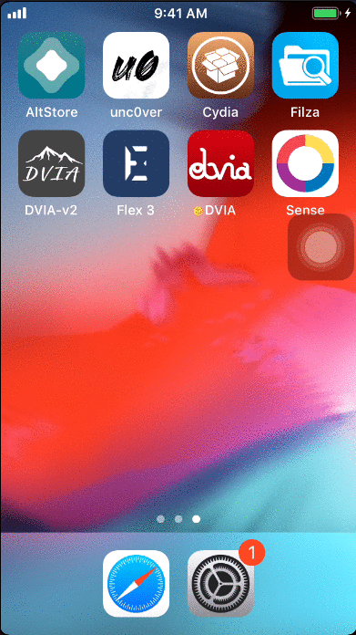

 iDrill is a static code analysis tool that performs various checks on an iOS Application such as:

- Checks Architecture
- Binary Encryption Check
- Stack Samashing Protection Check
- Address Space Layout Randomization Check
- Automatic Reference Counting Check
- Local Storage Check
- Kechain Check
- Many More…

The tool heavly depends on otool from Darwin CC Cydia Repository for analysis.

Want any feature to be added Ping me on my social media handle. I will definitely take them into consideration when scripting the next build.

Note: The tool does not read the code of the application for that you still need a MacOS and can export the IPA for analysis.

I would like to thanks @Mihir Doshi and @Gaurav Nayak for helping me code and solving all my queries.

Requirement:

Add https://apt.bingner.com in the Cydia source before installing iDrill.

Usage:

- Once the source is added in Cydia
- Install iDrill-v2
- SSH to the device ssh root@
- Run iDrill

